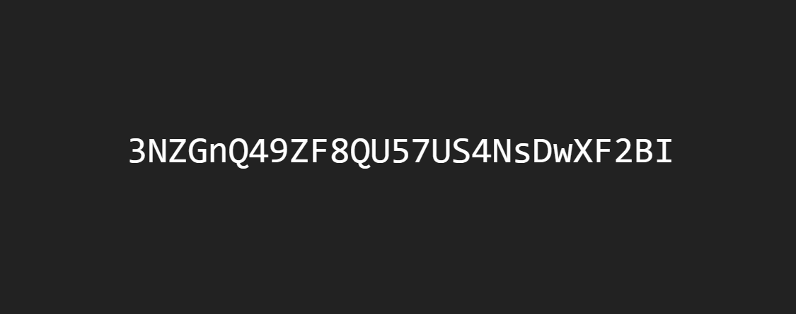

# Fingerprint

This tiny web page allows you to instantly generate a canvas fingerprint for your browser. It's a great tool for testing the extent to which your browser confiiguration is susceptible to cross-site tracking via canvas-based fingerprinting techniques. This implementaton really is *tiny*, with the core fingerprinting code only requiring about 300 bytes.




## Installation

```sh
$ npx serve .
```

You can also driectly copy-and-paste the code below into your projects to add fingerprinting functionality.


```js
async function createCanvasFingerprint() {

	// Create a canvas context...

	let canvasElement = document.createElement('canvas')
	let canvasContext = canvasElement.getContext('2d')

	canvasContext.fillText('abc', 0, 100)
	canvasContext.beginPath()
	canvasContext.arc(20, 20, 20, 0, 6)
	canvasContext.fillStyle = 'red'
	canvasContext.fill()

	let canvasData = (new TextEncoder).encode(canvasElement.toDataURL())
	let canvasFingerprint = await crypto.subtle.digest('sha-1', canvasData)

	canvasFingerprint = new Uint8Array(canvasFingerprint)
	canvasFingerprint = String.fromCharCode(...canvasFingerprint)
	canvasFingerprint = btoa(canvasFingerprint)

	return canvasFingerprint 
}
```


## Resources

* [Canvas Fingerprinting - Wikipedia](https://en.wikipedia.org/wiki/Canvas_fingerprinting)
* [Canvas Fingerprinting - BrowserLeaks](https://browserleaks.com/canvas)
* [How Does Canvas Fingerprinting Work - Fingerprint](https://fingerprint.com/blog/canvas-fingerprinting/)
